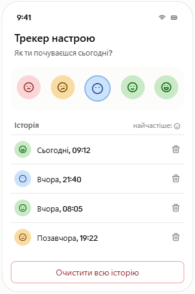

`Домашня робота №1`

## Створення застосунку "Трекер настрою"

Створити застосунок, в якому користувач може відмічати свій настрій та слідкувати за його динамікою.

У застосунку має бути ряд з 5 кнопок-емодзі (😢 😕 😐 🙂 😄), натискання на які додає запис у список з поточною датою/часом. Список має бути реалізовано за допомогою `FlatList`, що показує історію записів (емодзі + дата) від найновішого до найстарішого.

Додатково реалізувати:
- Видалення запису при натискання на нього (перед видаленням обов'язково має бути Alert з підтвердженням).
- Кнопку "Очистити всю історію" з попередженням через Alert.
- Невеликий підсумок зверху — яке emoji зустрічається найчастіше за весь час.
---

FlatList — https://reactnative.dev/docs/flatlist

Pressable — https://reactnative.dev/docs/pressable

Button — https://reactnative.dev/docs/button

Alert — https://reactnative.dev/docs/alert

---

    У MyStat потрібно завантажити код додатку та скриншоти його тестування.

---