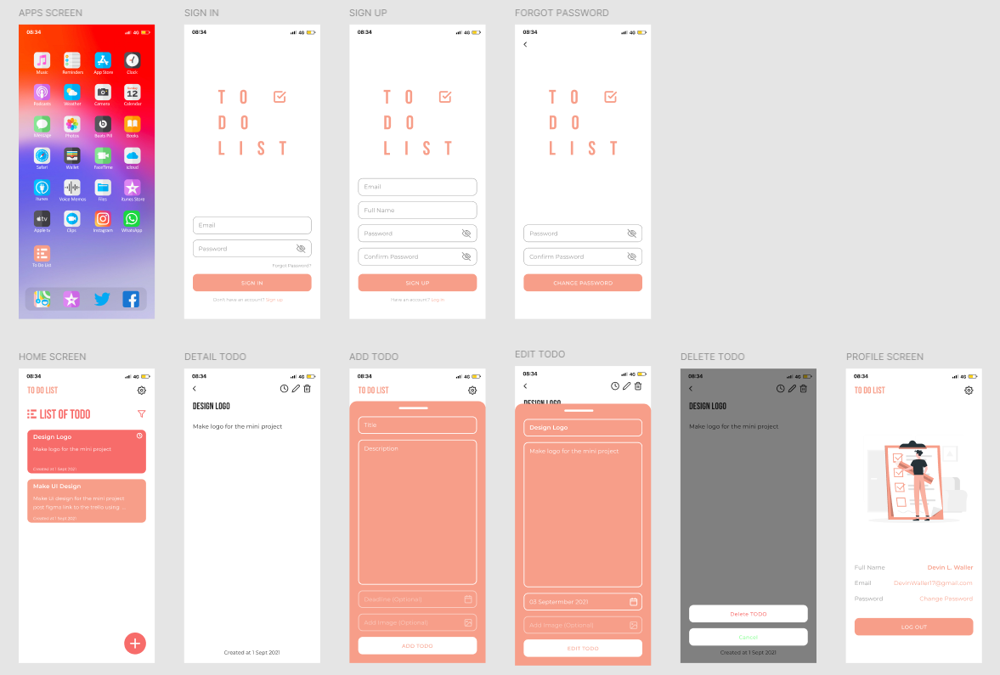

`Домашня робота №2`

## Створення застосунку "To-do list"

Створити застосунок для збереження задач з реєстрацією та збереженням даних у локальному сховищі. Задачі мають бути прив'язані до акаунту.

За основу взяти макет за посиланням: https://www.figma.com/design/ky5bzMpE4xRRC5ViQkxjOn/Learn-UIUX---To-Do-List-App--Community-?node-id=0-1&p=f&t=3iI9BPDsbec7z7fu-0

Вигляд основних елементів додатку:

---

    У MyStat потрібно завантажити код додатку та скриншоти його тестування.

---