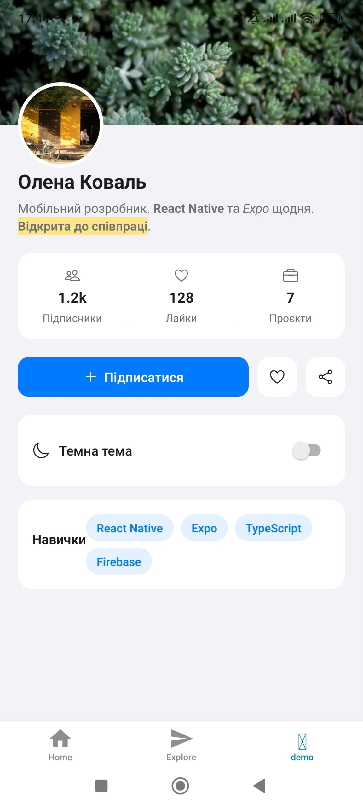

# 1. Вступ до React Native

## Зміст

1. [Що таке React Native](#що-таке-react-native)
2. [Що таке Expo](#що-таке-expo)
3. [Створення проєкту через Expo](#створення-проєкту-через-expo)
4. [Структура проєкту: app.json та package.json](#структура-проєкту-appjson-та-packagejson)
5. [Створення сторінки додатку](#створення-сторінки-додатку)
6. [Особливості синтаксису сторінки](#особливості-синтаксису-сторінки)
7. [HTML-теги та їх аналоги в React Native](#html-теги-та-їх-аналоги-в-react-native)
8. [Робота з іконками](#робота-з-іконками)
9. [Додавання зображень](#додавання-зображень)
10. [Створення працюючих кнопок](#створення-працюючих-кнопок)
11. [Повноцінний приклад сторінки](#повноцінний-приклад-сторінки)
12. [Як переглянути додаток на iOS та Android](#як-переглянути-додаток-на-ios-та-android)

---

## Що таке React Native


**React Native** — фреймворк від Meta для розробки мобільних додатків на JavaScript/TypeScript з використанням архітектурних принципів React. Головна ідея: код пишеться переважно один раз, а компілюється у **справжні нативні компоненти** для iOS та Android — не webview, як у гібридних рішеннях (Cordova, старий Ionic).

### Ключові принципи

- **"Learn once, write anywhere"**, а не "write once, run anywhere" — це офіційна філософія Meta. Попри крос-платформність, іноді доводиться писати платформо-специфічний код (`Platform.OS`, файли `.ios.js`/`.android.js`).
- **Компоненти рендеряться нативно.** `<View>` стає `UIView` на iOS і `android.view.View` на Android — звідси суттєво краща продуктивність порівняно з WebView-рішеннями.
- **Нова архітектура (New Architecture).** Сучасний React Native використовує Fabric (рендерер) і TurboModules (нативні модулі) замість старого асинхронного "мосту" (Bridge). Багато старих туторіалів в інтернеті описують саме стару архітектуру — це варто враховувати при самостійному пошуку інформації.
- **JSI (JavaScript Interface)** — механізм, що дозволяє JS напряму й синхронно викликати нативні методи, без серіалізації через міст.

### Що потрібно знати заздалегідь

- **JavaScript/TypeScript** — асинхронність (Promises, async/await), деструктуризація, модулі ES6.
- **React** — компоненти, JSX, хуки (`useState`, `useEffect`, `useContext`, `useRef`), props/state.

Хороша новина: **хуки та логіка компонентів у React Native працюють ідентично звичайному React**. Змінюються лише "будівельні блоки" верстки (замість HTML-тегів) та деякі назви подій.

---

## Що таке Expo


**Expo** — надбудова над React Native, що суттєво спрощує старт розробки та подальшу підтримку проєкту.

| | Expo | Bare React Native CLI |
|---|---|---|
| Старт проєкту | Миттєвий, без Xcode/Android Studio | Потрібні Xcode (iOS) та Android Studio (Android) |
| Готові модулі | Камера, геолокація, нотифікації тощо "з коробки" | Треба підключати й лінкувати вручну |
| Збірка | Через хмарний сервіс EAS Build | Локальна збірка |
| Контроль над нативним кодом | Обмежений (є `expo prebuild` для виходу в bare workflow) | Повний |

Сьогодні Expo рекомендують як стартову точку навіть для production-проєктів — за потреби в глибшому нативному контролі завжди можна зробити `expo prebuild` і отримати повноцінні `ios/` та `android/` папки.

---

## Створення проєкту через Expo

```bash
npx create-expo-app@latest
```

Команда запитає назву проєкту, створить папку та встановить залежності. Після завершення:

```bash
cd <назва-проєкту>
npx expo start
```

Це запустить **Metro** — бандлер JS-коду (аналог Webpack для React Native) — і покаже QR-код у терміналі, а також відкриє Expo Dev Tools у браузері.

> Детальніше про перегляд додатку на реальному пристрої чи в емуляторі — у [відповідному розділі](#як-переглянути-додаток-на-ios-та-android).

---

## Структура проєкту: app.json та package.json

Типова структура після `create-expo-app`:

```
my-app/
├── app/                  ← екрани додатку (файлова навігація Expo Router)
│   ├── (tabs)/
│   │   ├── index.tsx     ← екран Home
│   │   ├── explore.tsx   ← екран Explore
│   │   └── _layout.tsx   ← опис вкладок таб-бару
│   └── _layout.tsx        ← кореневий layout
├── components/           ← перевикористовувані компоненти
├── assets/               ← зображення, шрифти
├── app.json              ← конфігурація застосунку
├── package.json           ← залежності та скрипти
└── tsconfig.json
```

### app.json

Файл конфігурації самого застосунку (а не npm-пакета):

```json
{
  "expo": {
    "name": "MyApp",
    "slug": "my-app",
    "version": "1.0.0",
    "icon": "./assets/images/icon.png",
    "splash": {
      "image": "./assets/images/splash.png"
    },
    "ios": { "bundleIdentifier": "com.example.myapp" },
    "android": { "package": "com.example.myapp" }
  }
}
```

Тут визначається назва застосунку, іконка, splash screen, ідентифікатори застосунку для App Store / Google Play. Це знадобиться пізніше — при білді через EAS Build.

### package.json

Стандартний npm-файл: залежності (`react`, `react-native`, `expo`, `expo-router` тощо) та скрипти запуску (`"start": "expo start"`). Нічого специфічного для мобільної розробки тут немає — працює так само, як у будь-якому Node.js-проєкті.

---

## Створення сторінки додатку

Завдяки **Expo Router** навігація побудована на основі файлової структури (за аналогією з Next.js): кожен файл у папці `app/` автоматично стає окремим екраном/маршрутом.

### Додавання нової вкладки в таб-бар

1. Створити файл у `app/(tabs)/`, наприклад `profile.tsx`.
2. Наповнити його звичайним компонентом:

```tsx
import { View, Text } from 'react-native';

export default function ProfileScreen() {
  return (
    <View style={{ flex: 1, justifyContent: 'center', alignItems: 'center' }}>
      <Text>Мій профіль</Text>
    </View>
  );
}
```

3. Зареєструвати вкладку в `app/(tabs)/_layout.tsx`:

```tsx
<Tabs.Screen
  name="profile"
  options={{
    title: 'Профіль',
    tabBarIcon: ({ color }) => <IconSymbol name="person.fill" color={color} />,
  }}
/>
```

> `name` обов'язково має збігатися з назвою файлу (без розширення). Порядок вкладок у таб-барі визначається порядком `<Tabs.Screen>` у `_layout.tsx`, а не алфавітним порядком файлів.

Якщо потрібен екран **поза** вкладками (наприклад, екран деталей, що відкривається поверх) — файл кладеться не в `(tabs)/`, а на рівень вище, прямо в `app/`, і відкривається через навігацію (`router.push(...)`), а не через таб-бар.

---

## Особливості синтаксису сторінки

```tsx
import { View, Text, StyleSheet } from 'react-native';

export default function HomeScreen() {
  return (
    <View style={styles.container}>
      <Text style={styles.title}>Привіт, React Native!</Text>
    </View>
  );
}

const styles = StyleSheet.create({
  container: { flex: 1, justifyContent: 'center', alignItems: 'center' },
  title: { fontSize: 20, fontWeight: 'bold' },
});
```

### Головні відмінності від звичайного React (web)

- **Немає HTML-тегів** — тільки компоненти RN (`View`, `Text`, `Image` тощо). Повний перелік аналогів — у [розділі 7](#7-html-теги-та-їх-аналоги-в-react-native).
- **Весь текст обов'язково всередині `<Text>`** — на відміну від вебу, де голий текст у `<div>` працює нормально, в RN це викличе помилку.
- **Стилі — не CSS-файл, а JS-об'єкт:**
  - властивості в camelCase (`backgroundColor`, а не `background-color`);
  - числові значення без одиниць — це `px` за замовчуванням;
  - **немає каскадності** (окрім вкладених `Text` у `Text`);
  - немає класів/селекторів — тільки `style={styles.card}` або масив `style={[styles.a, styles.b]}`.
- **Flexbox поводиться інакше:** `flexDirection` за замовчуванням — `'column'`, а не `'row'`, як у вебі.
- **Події мають інші назви:** `onPress` замість `onClick`, `onChangeText` замість `onChange` (для `TextInput`).

---

## HTML-теги та їх аналоги в React Native

| Web (React) | React Native | Коментар |
|---|---|---|
| `<div>` | `<View>` | контейнер, тільки flexbox-компонування |
| `<p>`, `<span>`, `<h1>` | `<Text>` | увесь текст обов'язково всередині `<Text>` |
| `` | `<Image>` | `source={{ uri: '...' }}` або `source={require('./img.png')}` |
| `<button>` | `<Pressable>` / `<TouchableOpacity>` | немає нативного `<button>` з CSS-стилями |
| `<input>` | `<TextInput>` | керується через `value` + `onChangeText` |
| `<ul>`/`<ol>` + `.map()` | `<FlatList>` / `<SectionList>` | для великих списків — обов'язково, не `.map()` напряму |
| контейнер зі скролом | `<ScrollView>` | якщо контенту більше за висоту екрана |
| `<a>` | немає прямого аналога | навігація через Expo Router / React Navigation |

---

## Робота з іконками

У шаблоні Expo є компонент **`IconSymbol`** — це не окрема бібліотека, а **обгортка-мапер**: бере назву у стилі SF Symbols (iOS) і транслює її у відповідну Material Icon (Android/веб) через об'єкт `MAPPING` усередині `components/ui/icon-symbol.tsx`.

### Де шукати назви іконок

- **SF Symbols (iOS)** — офіційний застосунок **SF Symbols** від Apple (безкоштовний, з сайту Apple) — повний перелік з точними назвами (`house.fill`, `heart.fill`, `gearshape.fill`).
- **Material Icons (Android/веб)** — сайт **icons.expo.fyi** — зручний пошук і перегляд.

### Якщо потрібної іконки немає в MAPPING

`MAPPING` спочатку містить лише кілька пар, використаних у стандартному шаблоні. Нову іконку потрібно додати самостійно:

```tsx
// components/ui/icon-symbol.tsx
const MAPPING = {
  'house.fill': 'home',
  'paperplane.fill': 'send',
  'heart.fill': 'favorite', // ← нова пара: SF Symbol → Material Icon
};
```

Після цього іконка використовується так само, як і вбудовані:

```tsx
<IconSymbol name="heart.fill" color={color} size={20} />
```

### Альтернатива — `@expo/vector-icons`

Ще одна бібліотека, вбудована в Expo "з коробки" (встановлювати не треба), із сотнями готових іконок різних наборів (Ionicons, MaterialIcons, FontAwesome тощо):

```tsx
import { Ionicons } from '@expo/vector-icons';

<Ionicons name="heart-outline" size={24} color="#ff3b30" />
```

---

## Додавання зображень

```tsx
import { Image } from 'react-native';

// зображення з інтернету
<Image
  source={{ uri: 'https://example.com/photo.jpg' }}
  style={{ width: 200, height: 200 }}
/>

// локальне зображення з проєкту
<Image
  source={require('./assets/avatar.png')}
  style={{ width: 100, height: 100, borderRadius: 50 }}
/>
```

Важливі нюанси:

- На відміну від ``, розміри `<Image>` **обов'язково** треба задавати через `style` (`width`/`height`) — інакше зображення може не відобразитися взагалі.
- Кругле зображення (аватар) робиться так само, як у CSS — `borderRadius`, рівний половині ширини/висоти.
- Локальні файли підключаються через `require(...)`, а не через рядок шляху — це специфіка Metro-бандлера.

---

## Створення працюючих кнопок

У React Native немає нативного `<button>`, натомість використовується `Pressable` (сучасний варіант) або `TouchableOpacity` (старіший, простіший).

```tsx
import { useState } from 'react';
import { Pressable, Text, StyleSheet } from 'react-native';

export default function LikeButton() {
  const [liked, setLiked] = useState(false);

  return (
    <Pressable
      onPress={() => setLiked((prev) => !prev)}
      style={({ pressed }) => [
        styles.button,
        pressed && styles.pressed,
      ]}
    >
      <Text style={styles.text}>{liked ? '❤️ Подобається' : '🤍 Лайк'}</Text>
    </Pressable>
  );
}

const styles = StyleSheet.create({
  button: { backgroundColor: '#007AFF', padding: 12, borderRadius: 8 },
  pressed: { opacity: 0.7 },
  text: { color: '#fff', fontWeight: '600' },
});
```

Ключові моменти:

- Подія називається **`onPress`**, не `onClick`.
- `style` у `Pressable` може приймати **функцію** `({ pressed }) => [...]` — зручно для миттєвого візуального відгуку на натискання, без жодних додаткових бібліотек.
- Логіка дії — звичайний `useState`, ідентично React у вебі.
- Для системних діалогів корисний `Alert.alert('Заголовок', 'Повідомлення')` — швидкий спосіб показати щось "по-справжньому мобільне" вже на першому занятті.

---

## Повноцінний приклад сторінки

Нижче — приклад екрана-профілю, що об'єднує все з попередніх розділів в одному файлі: `View` як контейнери, кілька варіантів тексту (жирний/курсив/виділення), іконки (`@expo/vector-icons`), зображення (обкладинка + круглий аватар), кнопки з дією (підписка/лайк/поділитися), а також бонус — перемикач теми (`Switch`).

```tsx
// ProfileDemoScreen.tsx
import { useState } from 'react';
import {
  View,
  Text,
  Image,
  Pressable,
  ScrollView,
  Switch,
  Alert,
  StyleSheet,
} from 'react-native';
import { Ionicons } from '@expo/vector-icons';

export default function ProfileDemoScreen() {
  const [isFollowing, setIsFollowing] = useState(false);
  const [likes, setLikes] = useState(128);
  const [isLiked, setIsLiked] = useState(false);
  const [darkMode, setDarkMode] = useState(false);

  const handleLike = () => {
    setIsLiked((prev) => !prev);
    setLikes((prev) => (isLiked ? prev - 1 : prev + 1));
  };

  const handleShare = () => {
    Alert.alert('Поділитися', 'Тут був би виклик Share API 🙂');
  };

  const theme = darkMode
    ? { bg: '#121212', card: '#1e1e1e', text: '#f5f5f5', subtext: '#a0a0a0' }
    : { bg: '#f2f2f7', card: '#ffffff', text: '#1c1c1e', subtext: '#6e6e73' };

  return (
    <ScrollView
      style={[styles.screen, { backgroundColor: theme.bg }]}
      contentContainerStyle={styles.content}
    >
      <View style={styles.coverWrapper}>
        <Image
          source={{ uri: 'https://picsum.photos/seed/cover/600/200' }}
          style={styles.cover}
        />
        <Image
          source={{ uri: 'https://picsum.photos/seed/avatar/200/200' }}
          style={styles.avatar}
        />
      </View>

      <View style={styles.header}>
        <Text style={[styles.name, { color: theme.text }]}>Олена Коваль</Text>
        <Text style={[styles.bio, { color: theme.subtext }]}>
          Мобільний розробник.{' '}
          <Text style={styles.bold}>React Native</Text> та{' '}
          <Text style={styles.italic}>Expo</Text> щодня.{' '}
          <Text style={styles.highlight}>Відкрита до співпраці</Text>.
        </Text>
      </View>

      <View style={[styles.statsRow, { backgroundColor: theme.card }]}>
        <StatItem icon="people-outline" label="Підписники" value="1.2k" color={theme.text} sub={theme.subtext} />
        <View style={styles.statDivider} />
        <StatItem icon="heart-outline" label="Лайки" value={String(likes)} color={theme.text} sub={theme.subtext} />
        <View style={styles.statDivider} />
        <StatItem icon="briefcase-outline" label="Проєкти" value="7" color={theme.text} sub={theme.subtext} />
      </View>

      <View style={styles.actionsRow}>
        <Pressable
          onPress={() => setIsFollowing((prev) => !prev)}
          style={({ pressed }) => [
            styles.followButton,
            isFollowing && styles.followButtonActive,
            pressed && styles.pressed,
          ]}
        >
          <Ionicons
            name={isFollowing ? 'checkmark' : 'add'}
            size={18}
            color={isFollowing ? '#007AFF' : '#fff'}
          />
          <Text style={[styles.followText, isFollowing && { color: '#007AFF' }]}>
            {isFollowing ? 'Підписані' : 'Підписатися'}
          </Text>
        </Pressable>

        <Pressable
          onPress={handleLike}
          style={({ pressed }) => [styles.iconButton, { backgroundColor: theme.card }, pressed && styles.pressed]}
        >
          <Ionicons
            name={isLiked ? 'heart' : 'heart-outline'}
            size={20}
            color={isLiked ? '#ff3b30' : theme.text}
          />
        </Pressable>

        <Pressable
          onPress={handleShare}
          style={({ pressed }) => [styles.iconButton, { backgroundColor: theme.card }, pressed && styles.pressed]}
        >
          <Ionicons name="share-social-outline" size={20} color={theme.text} />
        </Pressable>
      </View>

      <View style={[styles.card, { backgroundColor: theme.card }]}>
        <View style={styles.cardRow}>
          <Ionicons name="moon-outline" size={20} color={theme.text} />
          <Text style={[styles.cardText, { color: theme.text }]}>Темна тема</Text>
        </View>
        <Switch value={darkMode} onValueChange={setDarkMode} />
      </View>

      <View style={[styles.card, { backgroundColor: theme.card }]}>
        <Text style={[styles.cardTitle, { color: theme.text }]}>Навички</Text>
        <View style={styles.tagsRow}>
          {['React Native', 'Expo', 'TypeScript', 'Firebase'].map((skill) => (
            <View key={skill} style={styles.tag}>
              <Text style={styles.tagText}>{skill}</Text>
            </View>
          ))}
        </View>
      </View>
    </ScrollView>
  );
}

function StatItem({
  icon,
  label,
  value,
  color,
  sub,
}: {
  icon: keyof typeof Ionicons.glyphMap;
  label: string;
  value: string;
  color: string;
  sub: string;
}) {
  return (
    <View style={styles.statItem}>
      <Ionicons name={icon} size={18} color={sub} />
      <Text style={[styles.statValue, { color }]}>{value}</Text>
      <Text style={[styles.statLabel, { color: sub }]}>{label}</Text>
    </View>
  );
}

const styles = StyleSheet.create({
  screen: { flex: 1 },
  content: { paddingBottom: 40 },
  coverWrapper: { position: 'relative', marginBottom: 48 },
  cover: { width: '100%', height: 140 },
  avatar: {
    width: 96,
    height: 96,
    borderRadius: 48,
    borderWidth: 4,
    borderColor: '#fff',
    position: 'absolute',
    bottom: -48,
    left: 20,
  },
  header: { paddingHorizontal: 20, marginBottom: 20 },
  name: { fontSize: 22, fontWeight: '700', marginBottom: 6 },
  bio: { fontSize: 14, lineHeight: 20 },
  bold: { fontWeight: '700' },
  italic: { fontStyle: 'italic' },
  highlight: { backgroundColor: '#ffe58a', fontWeight: '600' },
  statsRow: {
    flexDirection: 'row',
    marginHorizontal: 20,
    borderRadius: 16,
    paddingVertical: 16,
    marginBottom: 20,
  },
  statItem: { flex: 1, alignItems: 'center', gap: 4 },
  statDivider: { width: StyleSheet.hairlineWidth, backgroundColor: '#c7c7cc' },
  statValue: { fontSize: 16, fontWeight: '700' },
  statLabel: { fontSize: 12 },
  actionsRow: {
    flexDirection: 'row',
    alignItems: 'center',
    paddingHorizontal: 20,
    gap: 10,
    marginBottom: 20,
  },
  followButton: {
    flex: 1,
    flexDirection: 'row',
    justifyContent: 'center',
    alignItems: 'center',
    gap: 6,
    backgroundColor: '#007AFF',
    paddingVertical: 12,
    borderRadius: 12,
  },
  followButtonActive: { backgroundColor: '#e5f1ff' },
  followText: { color: '#fff', fontWeight: '600', fontSize: 15 },
  iconButton: {
    width: 44,
    height: 44,
    borderRadius: 12,
    justifyContent: 'center',
    alignItems: 'center',
  },
  pressed: { opacity: 0.6 },
  card: {
    marginHorizontal: 20,
    borderRadius: 16,
    padding: 16,
    marginBottom: 16,
    flexDirection: 'row',
    justifyContent: 'space-between',
    alignItems: 'center',
  },
  cardRow: { flexDirection: 'row', alignItems: 'center', gap: 10 },
  cardText: { fontSize: 15, fontWeight: '500' },
  cardTitle: { fontSize: 15, fontWeight: '700', marginBottom: 12 },
  tagsRow: { flexDirection: 'row', flexWrap: 'wrap', gap: 8 },
  tag: {
    backgroundColor: '#e5f1ff',
    paddingHorizontal: 12,
    paddingVertical: 6,
    borderRadius: 20,
  },
  tagText: { color: '#007AFF', fontSize: 13, fontWeight: '600' },
});
```

Щоб побачити результат — покласти файл у `app/(tabs)/` (наприклад, як `profile.tsx`), і він одразу стане робочою вкладкою.

Виглядає цей приклад наступним чином:


---

## Як переглянути додаток на iOS та Android

Після `npx expo start` у терміналі з'явиться QR-код і кілька опцій запуску.

### Найшвидший спосіб — Expo Go на реальному телефоні

1. Встановити застосунок **Expo Go** з App Store (iOS) або Google Play (Android).
2. Відсканувати QR-код із терміналу: на Android — камерою Expo Go, на iOS — стандартною камерою телефону.
3. Додаток завантажиться на телефон і одразу запуститься.

Це оптимальний варіант для щоденної роботи та навчання — не потребує Xcode/Android Studio.

### Емулятор / симулятор

- Натиснути `i` в терміналі — запускає **iOS-симулятор** (потрібен Mac з встановленим Xcode).
- Натиснути `a` в терміналі — запускає **Android-емулятор** (потрібен Android Studio з налаштованим AVD — Android Virtual Device).

Це повільніше на старті (потребує додаткового налаштування середовища), зате ближче до реальних умов збірки — варто освоїти пізніше в курсі.

### Fast Refresh

Під час розробки будь-яка зміна коду миттєво відображається на пристрої/емуляторі без ручного перезапуску — це головна перевага розробки на React Native/Expo для швидкої ітерації.

## Корисні посилання
- Документація React Native: https://reactnative.dev/
- Документація Expo: https://docs.expo.dev/
- Пошук іконок для додатку: https://icons.expo.fyi/